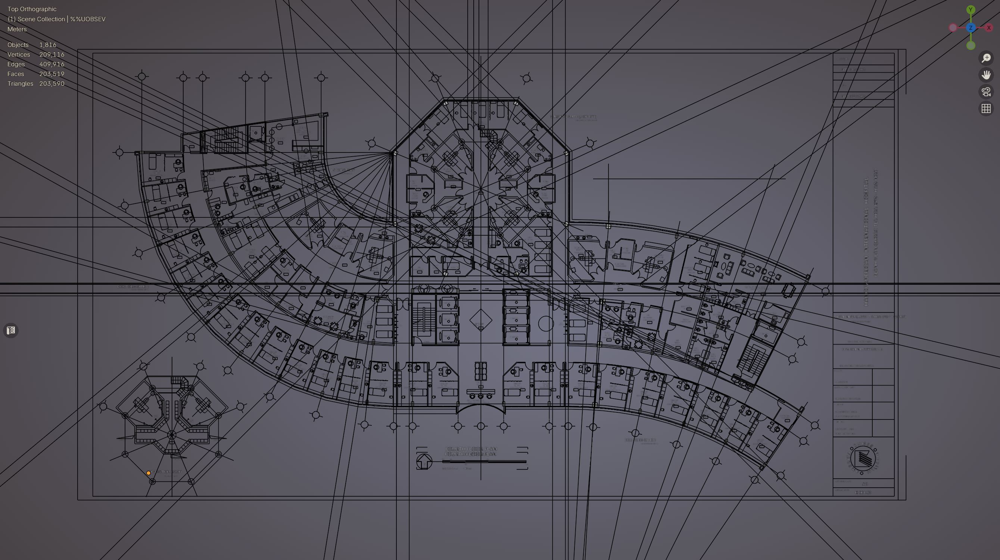
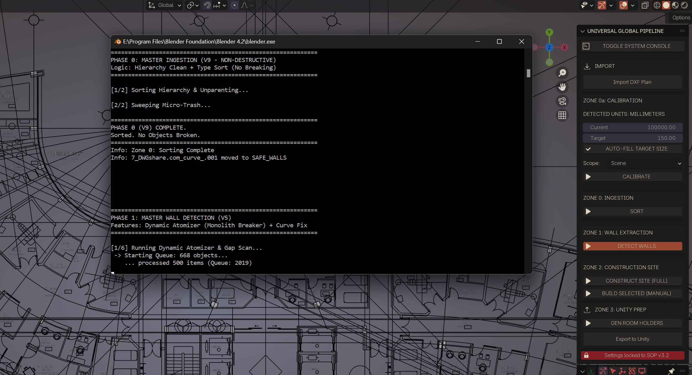
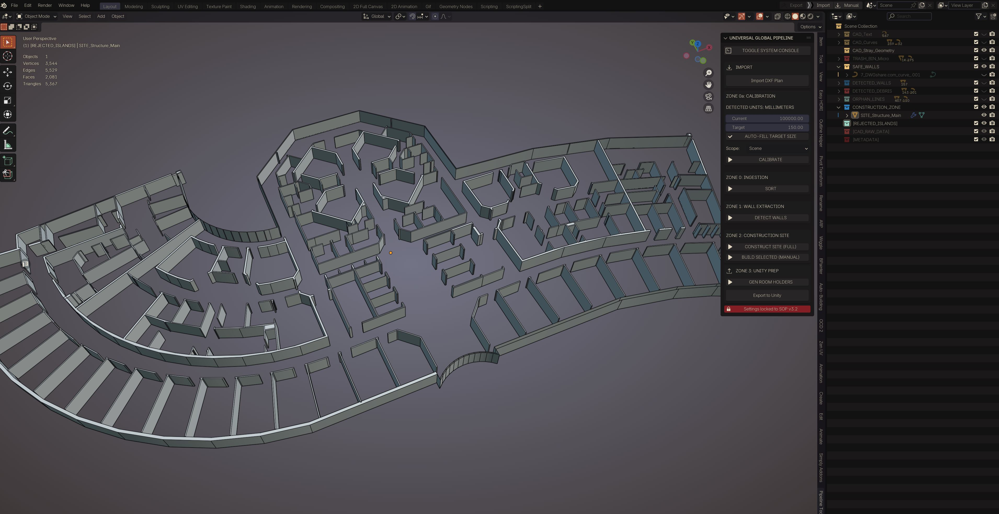
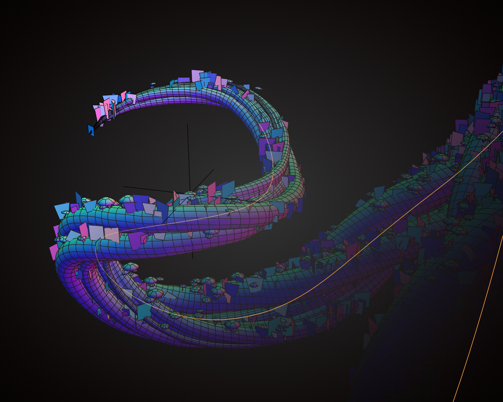
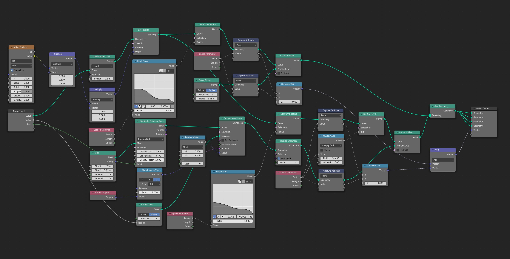
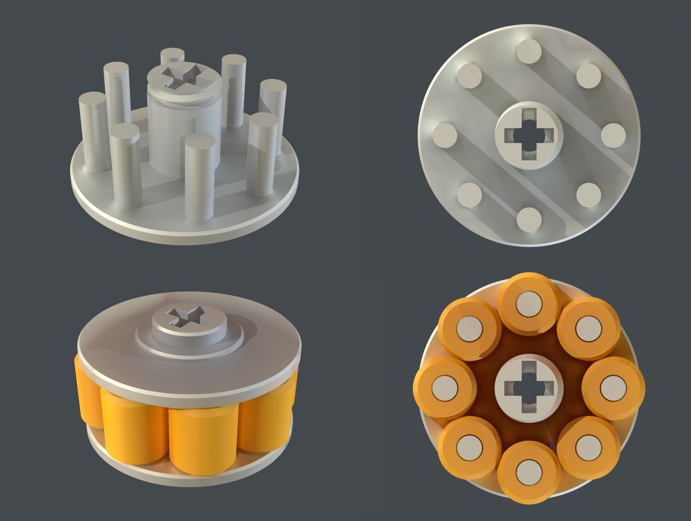
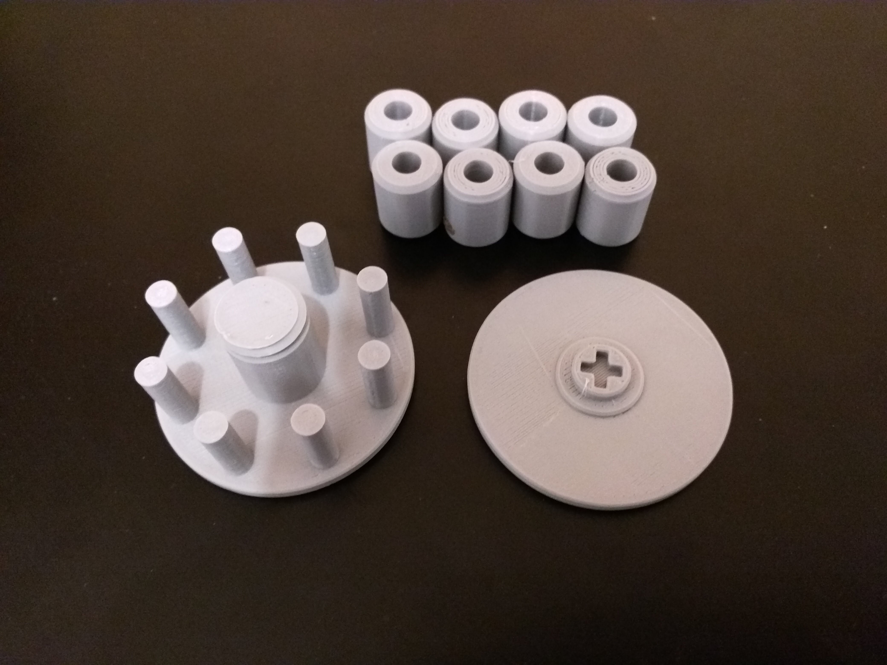

# Andra Perju | Technical Portfolio
### Pipeline Architecture • Mechanical Design • Procedural Logic

**Role:** Lead Technical Artist & Pipeline Developer
**Location:** Brașov, Romania
**Contact:** [LinkedIn](https://www.linkedin.com/in/andraperju) | [Email](mailto:andra@moonforgestudio.com)

---

## Table of Contents
1.  [**Software:** Universal Geometry Pipeline (UGP)]( #1-software-universal-geometry-pipeline-ugp)
2.  [**Logic:** Procedural Spline Architecture]( #3-logic-procedural-spline-architecture)
3.  [**Hardware:** Scientific Fluid Transfer Mechanism]( #2-hardware-scientific-fluid-transfer-mechanism)

---

## 1. SOFTWARE: Universal Geometry Pipeline (UGP)
### Automated CAD-to-Real-Time Optimization

**Context:** Siemens Healthineers Digital Twin Initiative.
**Impact:** Reduced data ingestion time by **99%** (154h $\rightarrow$ 1.5h per facility).

#### The Problem: The "Monolith" Bottleneck

Raw architectural exports (DXF/CAD) contained **7,600+ objects** per scene, often with merged layers where structural elements were combined with high-poly props.
* **Performance:** Importing a single facility froze the viewport for minutes.
* **The Cost:** Manual cleanup required **154 hours** per facility to achieve a bake-ready state.

#### The Solution: Algorithmic Geometry Filtering

I developed the **Universal Geometry Pipeline (UGP)**, a custom Python-based addon for Blender, designed to transform manual labor into a supervised automated workflow.
**Phase I: Heuristic Density Analysis (The “Geometric Sieve”)** The core innovation was removing the reliance on naming conventions. Instead, the tool analyzes the **DNA of the mesh** to categorize objects, reducing manual sorting to a **high-level verification task:**
* **Density Indexing:** The script calculates the ratio of vertices to Bounding Box Volume to flag High Density objects (furniture) vs Low Density structures (walls).
* **Assisted Sorting:** The tool auto-groups 80-90% of the scene based on geometry, flagging ambiguous items for rapid user decision rather than manual searching.
* **Orthogonality Checks:** Filters meshes based on normal direction. Strictly orthogonal normals + large surface area = Wall Candidate.
* **Parallelism Thresholds:** Implemented a "Gap Scan" logic (0.45m threshold) to detect parallel faces, distinguishing between thick structural walls and thin office partitions.

**Phase II: Automated Reconstruction (The "Constructor")**
Once isolated, the structural data is passed through a procedural reconstruction loop:
* **Island Detection:** Separates merged meshes into individual addressable objects.
* **Topology Repair:** Auto-weld vertices, cap holes, and recalculate normals.
* **Procedural Extrusion:** Converts 2D CAD floor plans into 3D volumes automatically.

**Phase III: Interoperability & UX**
* **Reverse-Engineered Export:** Wrote a custom FBX export handler that pre-calculates Unity’s coordinate system (Left-Handed Y-Up) to prevent rotation errors upon ingestion.
* **Asynchronous Feedback:** Implemented a console “heartbeat” to provide real-time status updates during heavy computation, preventing user perception of software freezing.

#### The Result: 99% Efficiency Gain

The UGP transformed the workflow from a manual artistic task into an automated engineering process.
* **Ingestion Time Reduced: 154 Hours → 1.5 Hours.**
* **Scalability:** Enabled the delivery of "One-Click" structural environments, allowing the team to focus purely on lighting and interaction logic.
* **Reliability:** Eliminated human error in scale conversion (Imperial/Metric) and mesh watertightness.

---

## 2. LOGIC: Procedural Spline Architecture
### Non-Destructive Geometry Nodes System

**Tools:** Blender 4.2/4.5, Geometry Nodes, Cycles/Eevee, Substance Painter (textures).

#### Spline-Driven Procedural Generation

Complex organic geometry is extruded non-destructively along a single Bezier curve. Topology flow and twisting are dictated by the curve's tilt parameters, allowing for infinite iteration of the silhouette without remodeling.

#### Radial Spline Architecture
The root system is not sculpted but calculated. Secondary geometry is generated via a revolving coordinate grid anchored to the parent Bezier curve.
* **Stochastic Control:** The chaos is strictly governed by seed values controlling torsion, displacement, and radial thickness.
* **Tangent-Space Mapping:** A custom tiling substance is mapped to the curve's tangent vector to simulate continuous grain flow along the deformation.

---

## 3. HARDWARE: Scientific Fluid Transfer Mechanism
### Mechanical Design & Prototyping (DFM)

**Role:** Scientific Modeling & Prototyping Engineer.
**Core Competency:** Rapid Prototyping / DFM / Tolerance Analysis.

#### 1. Parametric Modeling & Assembly Logic

Designed a multi-component rotary mechanism using **Autodesk Fusion 360**. The assembly required strict **tolerance analysis** to ensure the rotor bearings would apply consistent pressure to the tubing without causing occlusion or motor stall.
* Utilized **interference checks** in CAD before printing to prevent assembly collisions.

#### 2. Tolerance Testing & Material Validation
Executed a rapid prototyping loop using FDM printing. The challenge was calibrating the **clearance tolerances (0.2mm - 0.5mm)** for the printed bearings to rotate freely on the shaft while maintaining structural rigidity.
* Iterated on the housing design to account for **thermal shrinkage** inherent in the printing process.

---

**Authored by:** Andra Perju | [LinkedIn Profile](https://www.linkedin.com/in/andraperju)